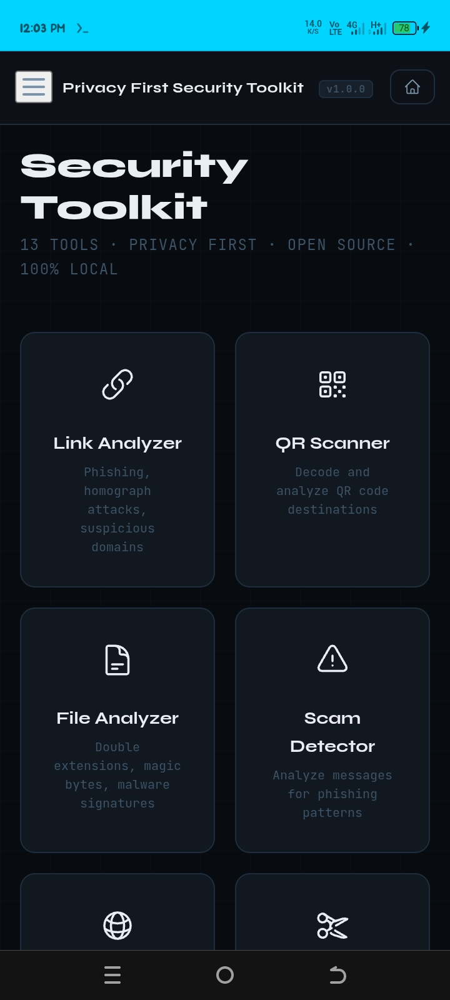
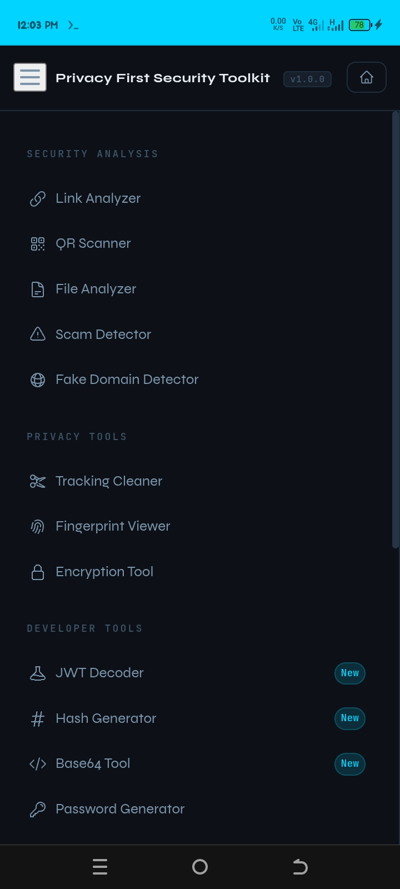

# Privacy First Security Toolkit 🛡️

<div align="center">

[](LICENSE)
[](https://developer.mozilla.org/en-US/docs/Web/JavaScript)
[](https://csrc.nist.gov/publications/detail/fips/197/final)
[](src/privacy.md)
[](https://privacy-toolkit-ten.vercel.app/)

**Privacy First Security Toolkit** is a comprehensive, browser-native cybersecurity workspace. Designed for absolute privacy, it performs 100% of its analysis locally—ensuring that your sensitive data, links, and files never leave your device.

[Live Demo](https://privacy-toolkit-ten.vercel.app/) · [Report Bug](https://github.com/alpha-1-design/privacy-toolkit/issues) · [Contributing](./CONTRIBUTING.md)

<div align="center">
  
  
</div>

</div>

---

## 🚀 Key Features

*   **Security Analysis:** Advanced link analysis (phishing detection), QR code scanning, and file signature auditing.
*   **Privacy Guard:** Tracking parameter removal, browser fingerprinting visualization, and secure text encryption.
*   **Developer Utilities:** JWT decoding, cryptographic hashing, Base64 encoding/decoding, and strong password generation.
*   **Plugin System:** Extensible architecture allowing for custom security detectors and analysis logic.
*   **Zero-Trust Privacy:** No cookies, no local storage, no analytics, and no cloud processing. Everything happens in browser memory.

---

## 🛡️ Tools Overview

| Category | Tools Included |
| :--- | :--- |
| **Analysis** | Link Analyzer, QR Scanner, File Analyzer, Scam Detector, Fake Domain Detector |
| **Privacy** | Tracking Cleaner, Fingerprint Viewer, AES-256-GCM Encryption Tool |
| **Utilities** | JWT Decoder, Hash Generator (SHA-2/HMAC), Base64 Tool, Password Generator |

---

## 🏗️ Architecture

The toolkit is built on a **Zero-Cloud Architecture**:
1.  **Input:** User provides data (URLs, text, files).
2.  **Analysis:** Logic executed via pure JavaScript ES Modules or custom Plugins.
3.  **Cryptography:** Leverages the native **Web Crypto API** for high-performance, secure operations.
4.  **Result:** Displayed immediately; data is cleared as soon as the tab is closed.

---

## 🛠️ Developer Integration

Import individual tools directly into your ES Module project:

```javascript
import { analyzeURL }    from './tools/link-analyzer.js';
import { analyzeMessage } from './tools/scam-detector.js';
import { decodeJWT }     from './tools/jwt-decoder.js';

// Analyze a suspicious URL
const result = await analyzeURL('https://paypaI-login-secure.xyz');
console.log(result.riskLevel);   // 'critical'
```

---

## 💻 Quick Start

### Local Development
```bash
# Clone the repository
git clone https://github.com/alpha-1-design/privacy-toolkit.git
cd privacy-toolkit

# Run the local server
python server.py
```
Visit `http://localhost:8080` in your browser.

---

## 📜 Contributing & Community

Contributions are what make the open source community such an amazing place to learn, inspire, and create. Please check out our [Contributing Guide](./CONTRIBUTING.md).

Distributed under the **MIT License**. Built for the Alpha-1 Ecosystem.
